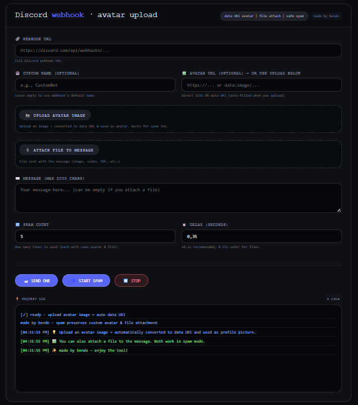

# Discord Webhook Tool

> Upload avatar, attach files, spam safely — all in one local tool.

**Live:** [https://ngz-cloud.github.io/dcwebhook/](https://ngz-cloud.github.io/dcwebhook/)

## Features
- 🖼️ Upload image as custom avatar (auto data URI)
- 📎 Attach files to messages
- 🤖 Override webhook name
- 🔁 Spam with configurable delay + stop button
- 🛡️ Respects Discord rate limits (auto retry on 429)

## Usage
1. Get a Discord webhook URL
2. Paste it into the tool
3. Customize name/avatar, write message, attach file (optional)
4. Click **SEND ONE** or **START SPAM**

---
Made by bende
